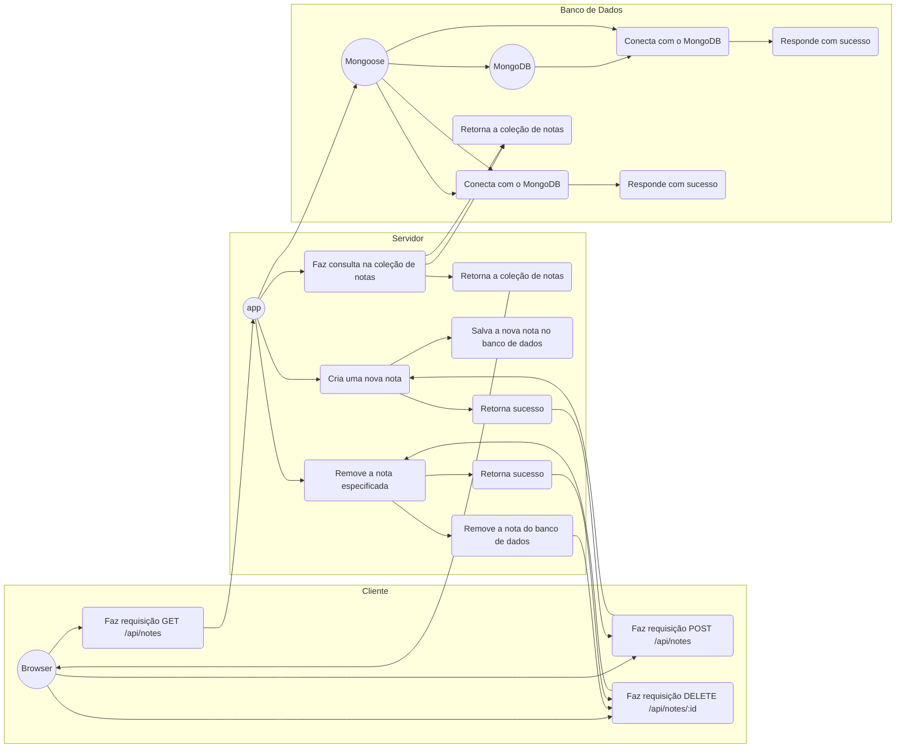

```mermaid
graph LR
    subgraph Cliente
        B((Browser)) --> A(Faz requisição GET /api/notes)
        B --> C(Faz requisição POST /api/notes)
        B --> D(Faz requisição DELETE /api/notes/:id)
    end

    subgraph Servidor
        F((app)) --> G(Faz consulta na coleção de notas)
        G --> H(Retorna a coleção de notas)
        F --> I(Cria uma nova nota)
        I --> J(Salva a nova nota no banco de dados)
        I --> K(Retorna sucesso)
        F --> L(Remove a nota especificada)
        L --> M(Remove a nota do banco de dados)
        L --> N(Retorna sucesso)
    end

    subgraph Banco de Dados
        O((MongoDB)) --> P(Conecta com o MongoDB)
        P --> Q(Responde com sucesso)
        R((Mongoose)) --> P
        R --> S(Conecta com o MongoDB)
        S --> T(Responde com sucesso)
        G --> U(Retorna a coleção de notas)
    end

    A --> F
    C --> I
    D --> L
    F --> R
    R --> O
    R --> S
    G --> U
    H --> B
    K --> C
    M --> D
    N --> D
```
